# Projects and Assets Portfolio
I have consolidated my projects & assets in below categories:

* [**Program Management Portfolio**](#program-management-portfolio)
* [**Data Science Portfolio**](#data-science-portfolio)
* [**Application Development Portfolio**](#application-development-portfolio)

 

# Program Management Portfolio

## Application Delivery Management

### Custom Application Delivery Management Framework

A **Program Management Framework** serves as a structured approach to plan, organize, execute, and monitor all aspects of a custom application delivery program. My 25+ years of experience in managing application development projects have gone into creating <a href="docs/Delivery_Management_Framework_Overview.pdf">this framework</a> that can jump-start any new program from scratch. The framework covers **17 core functional areas** with functional areas broken down into key activities and supporting tasks in the form of a MS Excel WBS.

### Custom Application Development (CAD) Method

Many times custom development projects fail because of lack of following software engineering disciplines. I had plenty of learnings from my **Delivery Excellence Leadership** experience, while reviewing critical projects, regarding why projects fail. I have put together these learnings in the form of a practical yet effective <a href="docs/Custom App Dev Method.xlsx">CAD Method</a> that I have succesfully used in complex development projects. I hope that budding delivery managers leverage these best practices (refer the <a href="docs/CAD Method Overview.pdf">Method overview</a>) to drive quality projects in their career.

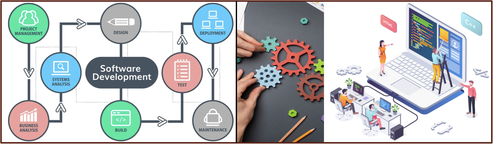

 

# Data Science Portfolio

## Deep Learning Models

### Melanoma Detection - CNN Classification

A Convolutional Neural Network (CNN) is a specialized deep learning model designed for processing grid-like data structures, such as images. Unlike traditional neural networks, CNNs leverage **spatial relationships** between pixels to extract important features (edges, textures, patterns) automatically. In this exercise, **class-wise data imbalance** issue was addressed by augmenting each class with additional images. This helped improving the accuracies above 80%.

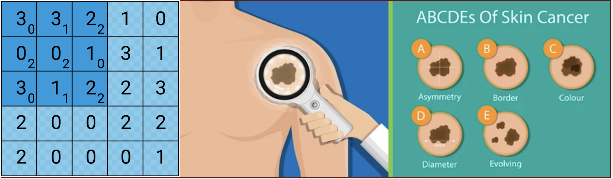

### Television Gesture Recognition - CNN-RNN (GRU) Classification

Recurrent Neural Networks (RNNs) are a class of neural networks designed for **processing sequential data**, such as time series, text, or video frames. The RNN GRU model is a specialised RNN that uses gating mechanisms, specifically **reset and update gates**, to mitigate issues like the vanishing gradient problem. After experimenting with Conv3D and CNN+RNN based models, a CNN-GRU model was finalised for gesture recognition, achieving a strong performance with a validation accuracy of 0.9.

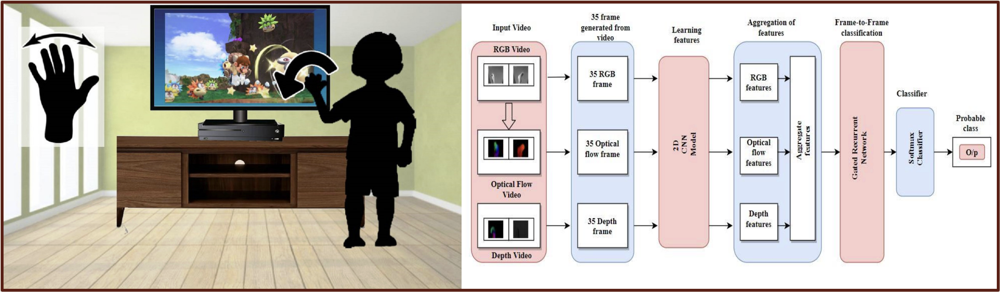

 

## Natural Language Processing (NLP) Models

### Healthcare Entities Recognition - CRF-based Solution

Conditional Random Fields (CRF) models excel in capturing **contextual dependencies** and structured relationships, making them particularly suitable for tasks like extracting named entities from texts. In this exercise, The model demonstrated very good performance, achieving an impressive **F1-score of 91.96%**, indicating high accuracy and robustness in recognising diseases and related treatments.

 

## Machine Learning Models

### Lending Club Case - Exploratory Data Analysis

Lending Club case study aims to analyse the data available with a NBFC regarding past loans and identify those factors which are strong indicators of loan defaults. Exploratory Data Analysis (EDA) techniques have been used in Python here after appropriate data cleaning & transformation. Extensive **univariate, bivariate and multi-variate analysis** have been done for numerical (histplot/ boxplot/ heatmap) and categorical (countplot/ barplot) variables to determine the key factors.

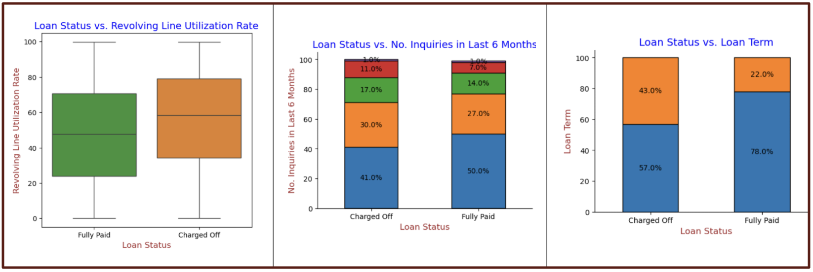

### Bike Share Demand Forecasting - Multi Linear Regression

This exercise aims to determine the factors that affect the demand for shared bikes in the American market. The factors mostly relate to local weather such as temperature, wind speed, month of the year, cloudy vs. rainy day, seasons etc. Multiple Linear Regression (MLR) that models a linear relationship between a **numeric target variable** and one or more predictor variables, has been utilized in this case study in a step-by-step manner to understand, analyse, transform and model the data provided for the analysis.  

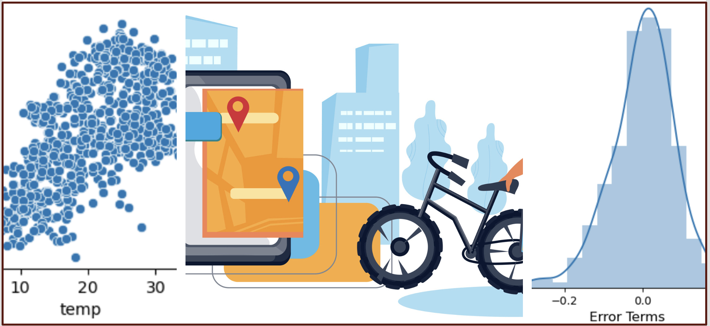

### Digits Recognition - Support Vector Machine Classification

A classic problem in the field of pattern recognition is that of handwritten digit recognition. Here we have used Support Vector Machine (SVM) model to classify images of handwritten digits ranging from 0-9 written by various people in boxes of a specific size. The 'pixel values' of each digit (image) comprise the features, and the actual number between 0-9 is the label. The developed SVM model **created a hyperplane classifier** that is able to predict a handwritten digit with an impressive sensitivity of 94%. 

### Telecom Churn - Logistic Regression Classification

This exercise aims to predict customer churn in a Telecom Firm using demographic, service usage, and expense data, with **churn** being a binary target variable for each customer. A multivariate logistic regression model was built for this purpose. An optimal probability cutoff of 0.3 was arrived at to achieve the model's sensitivity at 78% and accuracy at 77%. The model was found to be stable with test data, showing similar sensitivity (0.72) and specificity (0.749) scores, indicating it was not overfitting. 

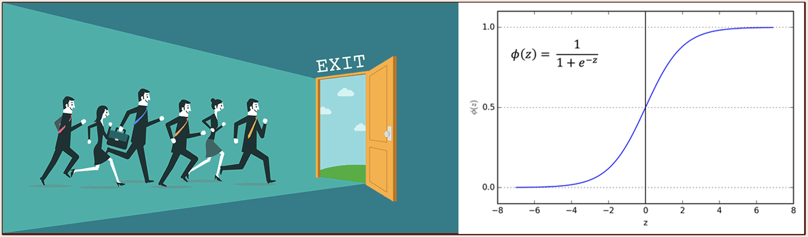

### Sentiment Analysis - Naive Bayes Classification

Naive Bayes is a simple yet powerful classification technique, especially useful for text classification and categorical data. The model has been applied on the first widely-available **sentiment analysis** datasets compiled by Pang and Lee's in 2002. The model works by identifying specific words that tend to show up in positive or negative reviews. An **accuracy** score of 83% has been achieved through this Multinomial Naive Bayes model.

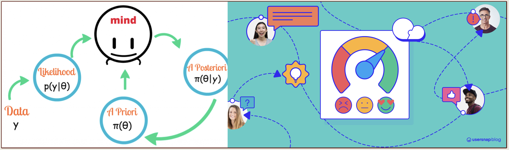

### Heart Disease Prediction - Decision Tree & Random Forest Classification

Random Forest is a versatile machine learning algorithm that excels in both classification and regression problems. In this exercise, a Random Forest model with 30 estimators (Decision Trees) and hyperparameters such as max_depth, max_features, min_samples_leaf etc. was developed to predict the **likelihood of heart disease**. The final model achieved a **test accuracy score of 0.83**, indicating good predictive performance with no signs of overfitting.

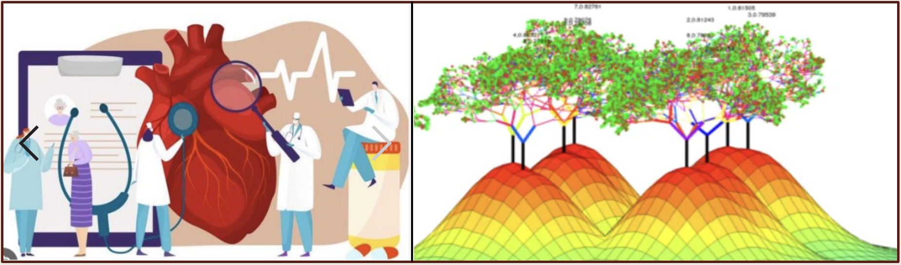

### Telecom Churn Prediction - Boosting-based Classification

Boosting is an **ensemble learning technique** that aims to combine the predictions of several weak learners (typically decision trees) to create a strong learner. The central idea is to sequentially train models, with each subsequent model focusing on correcting the errors made by the previous ones. For this telecom churn prediction exercise, higher **Recall score** was given importance keeping the business context in mind and **Gradient Boost** model showed a better performance.

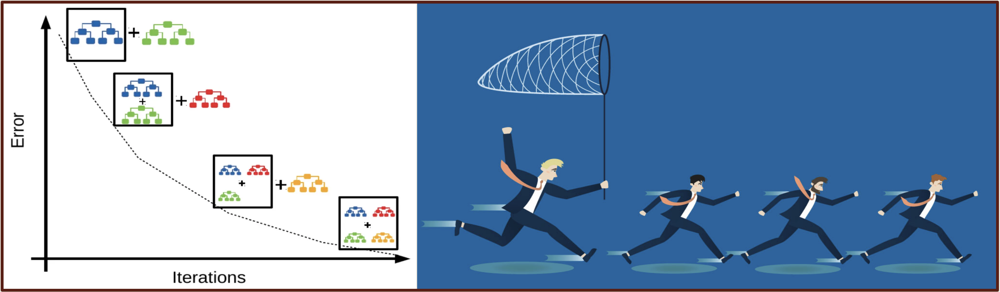

### Retail Customer Segmentation - K-Means and Hierarchical Models

Clustering is an **unsupervised machine learning technique** used to group similar data points into clusters based on their inherent characteristics. Two commonly used clustering algorithms are **K-Means** and **Hierarchical Clustering**. This clustering exercise has  provided valuable insights into **customer segmentation** for the online retail company - it identified distinct customer groups with varying spending behaviors.

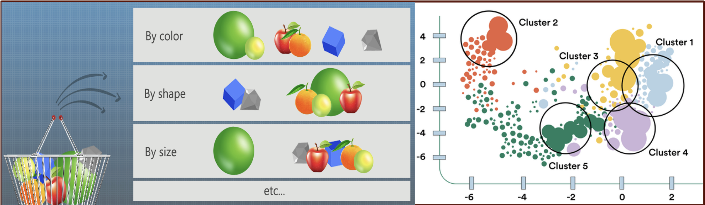

 

# Application Development Portfolio

## RESTfull Microservices Applications

### TODO Application - Spring Boot Backend

TODO application is a simple end-to-end web application that enables users to add, modify and delete TODO items. The backend has been developed as RESTful microservices using Spring Boot. It implements JWT token based security mechanism. The TODO microservice is accessed through Spring Cloud API Gateway. The scalability, maintainability, configurability, traceability best practices have been implemented as per the below architecture disgram.

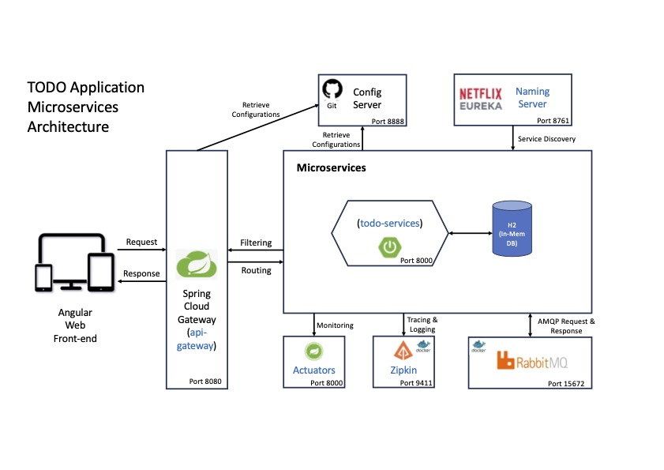

### TODO Application - Angular Frontend

The  web app provides a simple user interface to login to the system using existing user credentials and then manage the TODO items. The components, services and data-specific services best practices have been followed while building this application.

