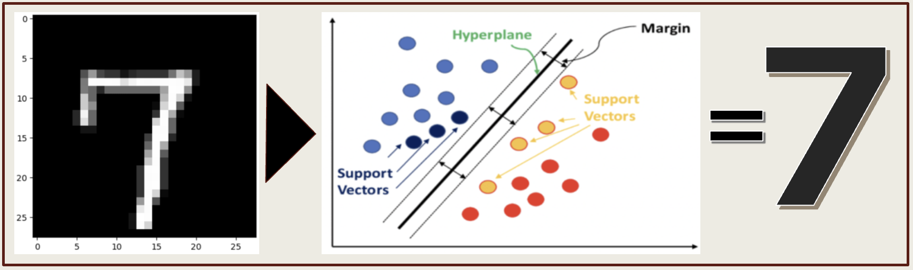

# Application Development Portfolio

## RESTfull Microservices Applications

### TODO Application - Spring Boot Backend

TODO application is a simple end-to-end web application that enables users to add, modify and delete TODO items. The backend has been developed as RESTful microservices using Spring Boot. It implements JWT token based security mechanism. The TODO microservice is accessed through Spring Cloud API Gateway. The scalability, maintainability, configurability, traceability best practices have been implemented as per the below architecture disgram.

### TODO Application - Angular Frontend

The  web app provides a simple user interface to login to the system using existing user credentials and then manage the TODO items. The components, services and data-specific services best practices have been followed while building this application.

 

# Data Science Portfolio

## Machine Learning Models

### Lending Club Case - Exploratory Data Analysis

Lending Club case study aims to analyse the data available with a NBFC regarding past loans and identify those factors which are strong indicators of loan defaults. Exploratory Data Analysis (EDA) techniques have been used in Python here after appropriate data cleaning & transformation. Extensive **univariate, bivariate and multi-variate analysis** have been done for numerical (histplot/ boxplot/ heatmap) and categorical (countplot/ barplot) variables to determine the key factors.

### Bike Share Demand Forecasting - Multi Linear Regression

This exercise aims to determine the factors that affect the demand for shared bikes in the American market. The factors mostly relate to local weather such as temperature, wind speed, month of the year, cloudy vs. rainy day, seasons etc. Multiple Linear Regression (MLR) that models a linear relationship between a **numeric target variable** and one or more predictor variables, has been utilized in this case study in a step-by-step manner to understand, analyse, transform and model the data provided for the analysis.  

### Digits Recognition - Support Vector Machine Classification

A classic problem in the field of pattern recognition is that of handwritten digit recognition. Here we have used Support Vector Machine (SVM) model to classify images of handwritten digits ranging from 0-9 written by various people in boxes of a specific size. The 'pixel values' of each digit (image) comprise the features, and the actual number between 0-9 is the label. The developed SVM model **created a hyperplane classifier** that is able to predict a handwritten digit with an impressive sensitivity of 94%. 

